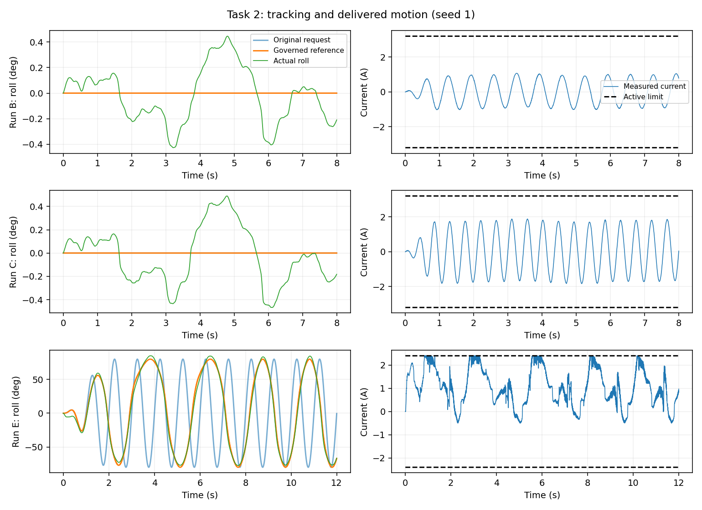
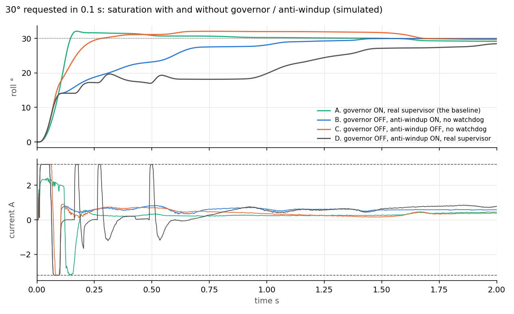
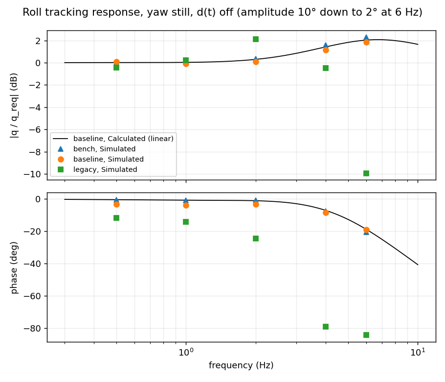
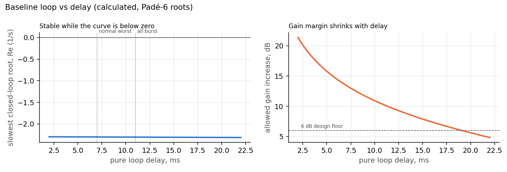
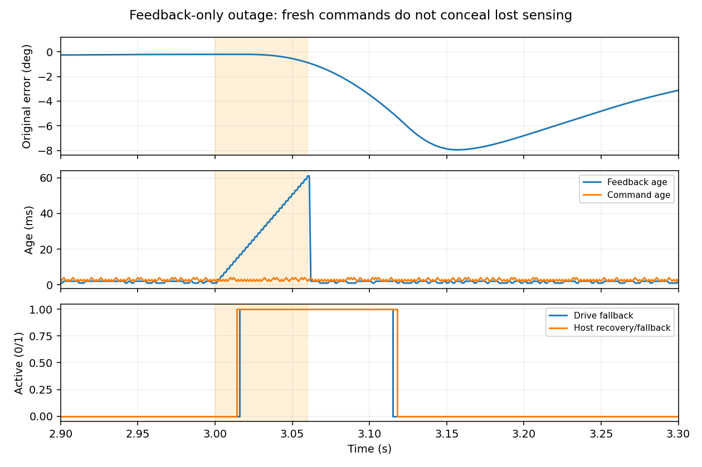
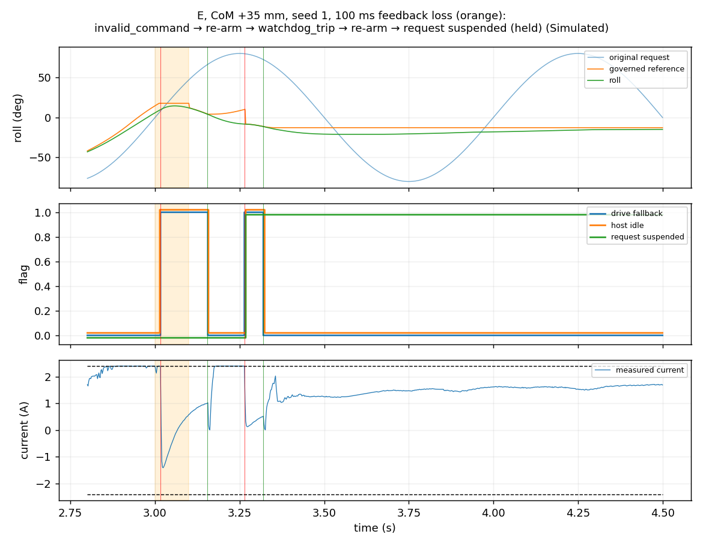
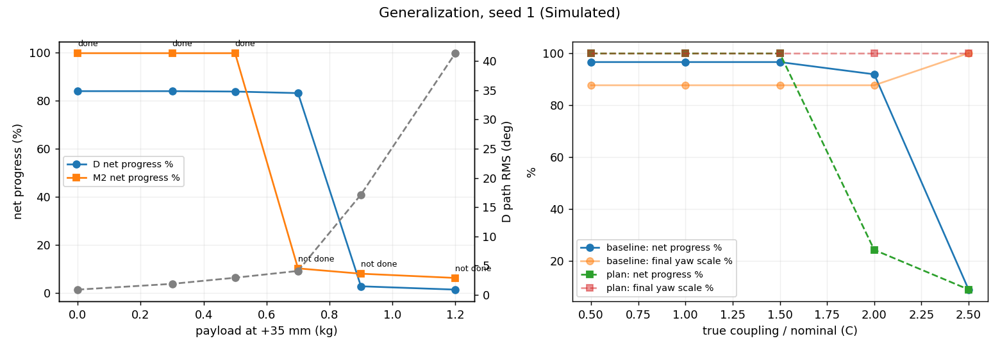
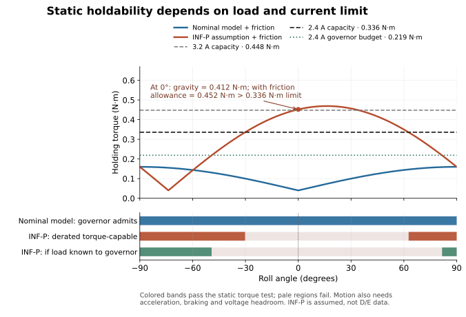
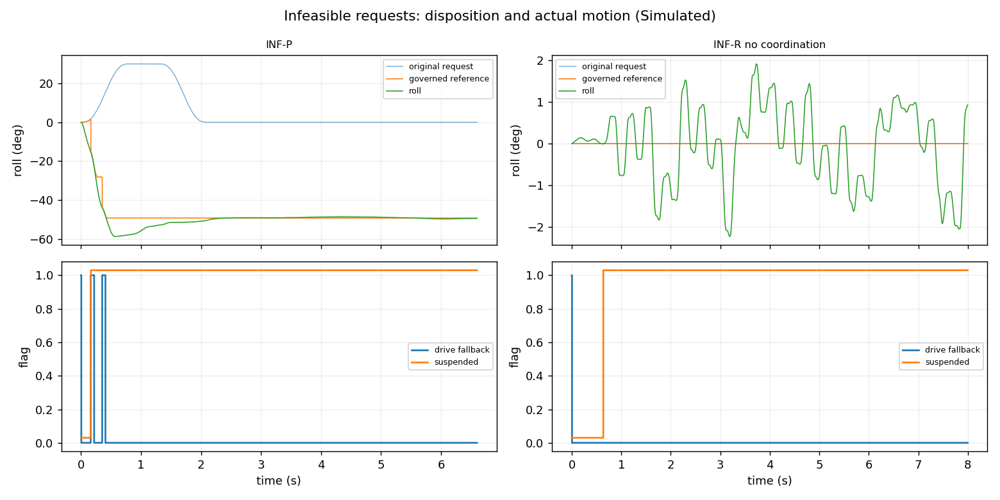

# Safe control for a coupled two-axis robot — technical memo

**Contribution and recommendation.** The frozen deterministic design (fingerprint `7d857df507c389c9`) combines yaw-torque compensation, a torque-aware path governor and fault containment: it distinguishes tracking, deliberate slowing and requests that cannot be held. Take it to hardware qualification. The tested adaptive load correction missed its adoption gates and is not part of that build.

- **In simulation:** the baseline tracks the A–C scenarios to 0.3–0.7° RMS with no faults and slows the loaded D/E requests rather than saturating blindly.
- **Infeasible requests:** it restricts or rejects those it can see; an unknown overload is attempted first, then caught and suspended.

**Labels:** *Observed* = the brief's five summaries only; *Calculated* = the supplied model; *Simulated* = our simulator, not hardware; *Proposed* = not yet done.

`uv run python run_all.py` regenerates all evidence in a locked environment: exact results and figures on macOS arm64; identical outcomes and numerical values within 3e-11 on Linux x86-64. The full answers are in [task1](task1.md)–[task5](task5.md).

## 1. Understanding the failure

**What the motor permits (Calculated).**

- **Torque ceiling:** KtImax = 0.448 N·m at 3.2 A and 0.336 N·m derated.
- **Run A does not exhaust the nominal current limit:** its 2.1 A peak is 0.294 N·m, 66% of the ceiling. At 45°, gravity plus friction and disturbance allowances need 0.175 N·m. The 2.8° RMS error motivates checking compensation, response and timing; voltage and full-trajectory feasibility remain unverified.
- **Yaw coupling (±75°):** 0.008 q̇y + 0.0008 q̈y peaks at 0.136 N·m at 1.5 Hz (B) and 0.247 N·m at 2.2 Hz (C). Including the 0.05 N·m disturbance and friction allowances, B needs 50% of nominal capacity. C needs 75% of nominal but 100.3% of derated: holdable at 3.2 A, marginal at 2.4 A.
- **Payload:** the 35 mm centre-of-mass shift adds 0.343·m N·m. The mass is not given, so D/E feasibility cannot be settled from the summaries.

**Leading explanation (hypothesis).** Moving yaw and a shifted payload add roll torque. The original controller may predict too little of it or respond too late, so roll deviates; the summaries do not identify which mechanism dominates or prove a current-limit failure.

- **B→C:** modelled coupling rises 1.82×; observed RMS rises 1.86× and peak error 1.80×.
- **D:** its +4.6° signed mean is 26% of the mean-square error, consistent with an unmodelled gravity load.
- **E:** 25% less torque gives 38% more error, assuming E keeps D's payload, which the brief does not state.

**What the summaries cannot prove:** the original controller (E's cycling does not prove windup), payload mass and direction, trajectory timing, what "clipped" counts, voltage use and thermal history. Our reconstructed legacy controller matches RMS ordering only to about 25%: a consistency check, not identification.

**Most decisive proposed experiment:** hold roll near zero and sweep yaw within a qualified envelope. Log synchronized encoders, current command/measurement, limits, timestamps and bus voltage. Fit yaw-velocity and acceleration torque terms on some frequencies; predict current and roll response at a held-out frequency. A good fit would support a revised coupling feed-forward and safe yaw envelope; a poor fit would redirect work to delay, calibration or friction. Neither outcome is established by A–E alone.

## 2. Baseline controller

| Element | Choice and reason |
|---|---|
| Rates | 500 Hz position loop, the brief's maximum. Phase loss is dominated by delay (1 ms command delay, 0.6–1.8 ms CAN, 1.2 ms current lag; 7 ms design, 11 ms burst corner), so a faster loop gains little. 1 kHz drive-side supervisor. |
| Feedback | PI × lead, C(s) = 0.7553(1 + 2.8/s)(1 + s/7)/(1 + s/112), Tustin-discretized; 4.46 Hz crossover. |
| Feed-forward | Nominal inertia, gravity and 80% friction on the *governed* reference. Yaw coupling from a causal Kalman estimate of the yaw encoder, predicted 4 ms ahead; no future yaw plan. |
| Estimates | 14-bit encoder, 0.022° per count. One count differentiated at 500 Hz is 0.19 rad/s, ten times the friction speed scale, so velocity is filtered and friction compensation uses reference velocity. |
| Saturation | Feed-forward-priority clamp, conditional-integration anti-windup, target clamped to the latest 3.2/2.4 A limit after the delay queue. |
| Governor | Admits motion within 0.8·KtIlim − 0.05 N·m (nominal load model). |
| Faults | Communication loss → drive-local damping; re-arm after 50 ms of fresh aligned commands. Error > 12° for 40 ms → latched fault, host catch, request suspended until replanned. 3 latches in 30 s → lockout. Overspeed and thermal trips. |

**When to reshape, derate or reject (governor rules):**

- **Reshape** (slow the path clock) when dynamic torque exceeds the budget but every pose is holdable.
- **Derate** the budget as soon as the current limit drops.
- **Restrict or reject** poses whose static holding demand exceeds capacity; slowing cannot fix a static overload.
- **Request yaw reduction,** or suspend with a coordinated stop, when coupling exceeds roll authority.
- **Never** shift a stationary reference to absorb a disturbance.

**Why it should stay well behaved.**

- **Margins (Calculated):** 49.4° phase margin and 13.5 dB gain margin at 7 ms; 32.1° and 6.1 dB at the 11 ms corner with J −30% and Kt +15%; 37.8 ms pure-delay margin.
- **Stress tests (Simulated):** 60 ms outages in either or both directions, burst storms, 5% message loss, the combined corner, and 20 V with R +25% are event-free or re-arm automatically. The 20 V fast sweep is reshaped to 58% progress.
- **Sampled plants (20 per scenario):** A/B/C have no events but meet the tracking threshold in 13, 20 and 15 of 20; D/E have events in 5 and 6 of 20.
- **Quantization:** about 31 mA of current jitter in Run B (7.6 mA at 24 bits), with no instability. Hunting at hold is about 0.2° of friction stick-slip.
- **Not proven:** stability under deep saturation with an unknown load, the main residual risk given negative gravity stiffness.

## 3. Learning: evaluated and rejected

**Candidate.** A bounded two-parameter load residual, θs sin q + θc cos q.

- **What it observes:** delayed measured roll/yaw, measured current, the active limit and health timestamps, during healthy, settled, yaw-stationary 250 ms dwells.
- **Timing:** it updates at ≤ 50 Hz on a non-blocking worker (2–8 ms latency) and discards results older than 100 ms.
- **What it changes:** feed-forward only, ≤ 0.20 N·m. The governor, limits and faults keep the nominal model.
- **When it is ignored:** on stale, invalid, faulted, saturated, mismatched, under-covered or expired data.

**Registered comparison (Simulated).** The protocol, untuned held-out loads (5 loads × 2 limits × 5 seeds), metric (RMS over the first 0.5 s of each test dwell) and gate are cited in a commit made before the candidate was run; the plan file itself was first committed together with the results. The gate requires ≥ 10% median paired improvement over the best retuned deterministic comparator, ≥ 80% availability, and no safety or completion regression.

| 50 held-out pairs | Median primary | vs `int1` | Completed |
|---|---:|---:|---:|
| `int1`: retuned comparator (= frozen baseline) | 2.130° | — | 40/50 |
| `int2`: faster integrator, fails margin criteria | 1.157° | +42.6% | 50/50 |
| **Adaptive candidate** | 2.088° | **0.0%** | 40/50 |
| Known-load feed-forward oracle (not deployable) | 0.499° | +76.9% | 50/50 |

- **The 0.0% is exact:** the candidate is `int1` plus the learned term on the same seed. In 30 of 50 pairs the correction never changed a scored command: never usable (13), or first usable at 18.3–21.6 s (17), at the end of the test where bumpless transfer cancels a change at constant reference. These pairs are bit-identical to `int1`.
- **When it was on in time, it helped:** 20 pairs improved, 8 of them by 42–79%, and none got worse (mean +9.5%, not registered).
- **Gate:** fails on benefit and on availability (74%). No safety criterion fails in the held-out runs or in 96 registered challenge runs (yaw B/C, feedback loss, derating). The correction was usable after onset in 23/48 candidate challenge runs, but this is an upper bound on meaningful exercise: in two, it never exceeded 0.0004 N·m; in one, it was usable for just 0.3% of the post-onset time. It was never usable in the 9 s-onset yaw B/C sets. Most challenges therefore test the baseline. Mid-run payload change was not tested.
- **Incomplete runs:** the 10 in each variant reach every waypoint but overshoot the ±65° range by 5.65–6.89° (5° allowed).

`int2` improves held-out tracking and completion but misses the declared nominal/corner margin thresholds (43.7°/28.1° phase, 5.7 dB corner gain); this is a design-rule exclusion, not proof of hardware danger. The frozen `int1` retains margin reserve.

**What would change the learning choice:** the oracle shows about 77% potential, but only 4/50 adaptive runs were usable before testing. A read-only replay traced the delay to insufficient eligible, diverse calibration dwells; once coverage passed, worker publication took 4–8 ms. Compare bounded calibration and stationarity changes on tuning cases, then pre-register a new held-out test including payload change.

## 4. Evidence

**Simulator:** 10 kHz plant integration; current lag, command delay, CAN latency with bursts and loss; 14-bit encoders; multirate timing; current and voltage limits (R 1.8 Ω ± 25%, L 0.45 mH ± 20%, Ke = Kt, bus to 20 V). Uncertainty covers J ± 30%, Kt ± 15%, friction, payload, coupling and latency.

| Scenario (5-seed median) | Legacy RMS | Final governed RMS | Original-request RMS | Progress | At limit | Tracked |
|---|---:|---:|---:|---:|---:|---:|
| A shaped ±45° | 3.50° | 0.68° | 0.74° | 100% | 0.0% | 5/5 |
| B yaw 1.5 Hz | 3.57° | 0.27° | 0.27° | 100% | 0.0% | 5/5 |
| C yaw 2.2 Hz | 7.64° | 0.40° | 0.40° | 97% | 0.0% | 5/5 |
| D payload ±80° | 10.23° | 4.10° | 76.7° | 83% | 1.9% | 0/5 |
| E D at 2.4 A | 12.02° | 4.25° | 78.5° | 51% | 5.5% | 0/5 |

- **Legacy** is a reconstruction; both controllers are simulated.
- **B/C:** roll is commanded to hold 0° while yaw oscillates; their 100%/97% “progress” is a path-clock metric for that stationary roll request, not delivered roll distance. C separately reduces yaw amplitude to 0.88× in one run.
- **D/E:** the governed error is small only because the requests are slowed. The original-request error shows the sacrificed timing, and D/E count as not tracked (tracked = ≥ 95% progress, ≤ 2° RMS, no fault; a project threshold).

**Right answer is not to track:**

- **INF-P:** 1.2 kg at +35 mm, derated, needs 0.41 N·m of static torque against 0.336 N·m available. The nominal-model baseline cannot know this: it attempts the move, sags to about −58°, trips, and is held near −49° after the catch, suspended. This is a reported limitation. A truth-informed governor rejects such a load outright.
- **INF-R:** roll hold under 2.8 Hz yaw. The governor reduces yaw to 0.36× and holds roll within ±1.1°.
- **Loaded M2:** trips and stays suspended rather than cycling.
- **Fallback:** local damping does not hold against gravity; a loaded 100 ms outage moves the axis up to 42°.

**Reproducibility.** A fresh `git archive` snapshot installed from `uv.lock` reproduced every result value, run_id and figure exactly on the Mac. On Linux x86-64, all outcomes were identical and values agreed to 3e-11 (NumPy rounds random draws differently across CPUs) ([R4](packets/R4.md)). 262 unit tests pass.

## 5. Testing the explanation

**Registered prediction (Calculated; the registration and the results were first committed together, so git gives no ordering evidence).** In Run B, weaken the true Kt and Ke by 10% with the controller unchanged. Predicted: coupling peak 0.1356 N·m (0.969 A), extra ideal current +0.108 A (±0.15 A), and an uncancelled coupling residual of +0.0136 N·m (±0.01).

**Result (Simulated: 3 seeds, feed-forward on/off pairs, 2–8 s).** A windowing and unit bug in our first analysis was found and corrected retrospectively ([R2](packets/R2.md)).

- **Consistency checks only:** the coupling and ideal-current matches re-check the model's own arithmetic.
- **Not tested:** the extra current is not separable in the total current, and its tolerance includes 0.
- **Not resolved by the selected peak metric:** the post hoc residual-peak increase was −0.0007 N·m. Causal yaw-estimate transients (about 0.03 N·m) obscure the predicted component in this Run B comparison. With exact feed-forward (a diagnostic), +0.0123 N·m appears.
- **Supported:** feed-forward stays valuable, and removing it costs 3.5–3.9°.
- **Not uniform:** the weaker motor raised error in only 2 of 3 pairs.

**Revised explanation:** for this Run B peak metric and operating point, yaw-estimate transients exceed the measured motor-strength effect. This does not rank their importance across other motions.

**Smallest justified design change: none to the frozen controller.** If hardware calibration finds that the effective Kt differs from nominal, rescale the feed-forward current by Kt,nom/Kt,meas. That is one parameter, and it is proposed, not tested.

**Hardware confirmation:** blocked-axis torque/current identification, guarded moving back-EMF identification, then the roll-held yaw sweep ([qualification plan](hardware_qualification_plan.md)).

**Risks carried to hardware:** the drive voltage convention (Vbus vs Vbus/√3), the loaded fallback excursion, admission of unknown-load moves that later trip, and assumed thermal thresholds.

---

## Appendix A — Plots (outside the page limit)

<figure class="plot-page"><figcaption><strong>Figure 1. Tracking and delivered motion.</strong> Blue is the original roll request, orange the governed roll reference, green actual roll; right panels show current and its active limit. B/C command a 0° roll hold while yaw oscillates at 1.5/2.2 Hz, so their blue and orange roll lines coincide at zero while coupling moves the actual roll. E's requested sweep is slowed substantially; its small governed error does not imply on-time delivery.</figcaption></figure>

<figure class="plot-page"><figcaption><strong>Figure 2. Saturation and anti-windup.</strong> Compare governed motion with the diagnostic governor-disabled case; current limiting and integrator handling must be read with the delivered path, not the error trace alone.</figcaption></figure>

<figure class="plot-page"><figcaption><strong>Figure 3. Linear loop margins.</strong> Frequency response and phase reserve at the declared design and burst-delay conditions. These local margins do not prove stability under unknown-load saturation.</figcaption></figure>

<figure class="plot-page"><figcaption><strong>Figure 4. Delay robustness.</strong> Calculated margins and simulated behavior across the stated delay/parameter probes; these are tested conditions, not a hardware-wide guarantee.</figcaption></figure>

<figure class="plot-page"><figcaption><strong>Figure 5. Feedback loss.</strong> Read drive fallback, host recovery and delivered progress together. Drive-local damping reduces motion but does not guarantee a position hold under gravity.</figcaption></figure>

<figure class="plot-page"><figcaption><strong>Figure 6. Fault and catch.</strong> The tracking fault leads to a catch and suspended request; a bounded catch is not completion of the original command.</figcaption></figure>

<figure class="plot-page"><figcaption><strong>Figure 7. Selected uncertainty trials.</strong> A–E tracking and fault counts vary across sampled plants. The selected parameter ranges are stress cases, not measured population probabilities.</figcaption></figure>

<figure class="plot-page"><figcaption><strong>Figure 8. Static torque boundary (Calculated).</strong> Nominal and assumed INF-P demand include a 0.04 N·m friction allowance; horizontal lines show actuator capacities and the stricter 2.4 A governor budget. At 0°, INF-P gravity alone needs 0.412 N·m, above 0.336 N·m derated capacity, while the unaware nominal governor admits the pose. Colored bands show angle-specific static tests, not dynamically reachable paths. D/E payload masses are unknown.</figcaption></figure>

<figure class="plot-page"><figcaption><strong>Figure 9. Infeasible request.</strong> The unknown INF-P load exceeds derated static capacity at 0°. The nominal-model controller initially attempts it, then faults and suspends; the plot reports the resulting motion rather than a successful hold.</figcaption></figure>
